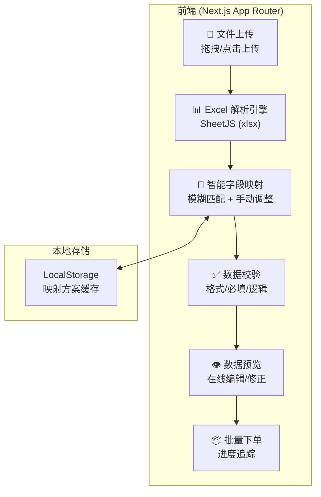

# 物流快递 Excel 批量下单 Web 应用

## 项目概述

开发一个面向物流/快递行业的 Web 应用，支持多种 Excel 模板的**自动识别与智能映射**，完成批量下单流程，并部署到 Vercel 平台。

### 核心痛点
- 客户 Excel 模板格式各异（列名不同、列序不同、合并单元格）
- 人工逐条录入效率低、易出错
- 缺乏统一的数据校验机制

---

## 技术架构



### 技术栈

| 层面 | 技术选型 | 说明 |
|------|---------|------|
| 框架 | **Next.js 14** (App Router) | SSR/SSG + API Routes, Vercel 原生支持 |
| 样式 | **Vanilla CSS** + CSS Variables | 设计系统 + 主题 + 动画 |
| Excel 解析 | **SheetJS (xlsx)** | 客户端解析，支持 .xlsx/.xls/.csv，处理合并单元格 |
| 状态管理 | **React Context + useReducer** | 轻量级，适合中等复杂度 |
| 图标 | **Lucide React** | 现代轻量图标库 |
| 字体 | **Inter** (Google Fonts) | 现代无衬线字体 |
| 部署 | **Vercel** | 零配置部署 |

---

## 核心功能设计

### 1. Excel 解析引擎

**支持格式**: `.xlsx`, `.xls`, `.csv`

**处理策略**:
- 自动检测合并单元格并展开
- 智能识别表头行（跳过空行、标题行）
- 支持多 Sheet 选择

### 2. 智能字段映射

**系统预设字段**（物流下单标准字段）:

| 字段 | 字段名 | 必填 | 说明 |
|------|--------|------|------|
| 发件人姓名 | `senderName` | ✅ | |
| 发件人电话 | `senderPhone` | ✅ | |
| 发件人地址 | `senderAddress` | ✅ | 省市区+详细地址 |
| 收件人姓名 | `receiverName` | ✅ | |
| 收件人电话 | `receiverPhone` | ✅ | |
| 收件人地址 | `receiverAddress` | ✅ | 省市区+详细地址 |
| 物品名称 | `itemName` | ✅ | |
| 物品数量 | `itemQuantity` | ❌ | 默认 1 |
| 重量(kg) | `weight` | ❌ | |
| 备注 | `remark` | ❌ | |
| 付款方式 | `paymentMethod` | ❌ | 寄付/到付/月结 |
| 保价金额 | `insuredValue` | ❌ | |

**自动映射策略**（模糊匹配）:

```
"发件人" / "寄件人" / "发货人" / "sender" → senderName
"发件电话" / "寄件人手机" / "发货电话" → senderPhone
"收件人" / "收货人" / "签收人" / "receiver" → receiverName
"收件电话" / "收货手机" / "联系电话" → receiverPhone
"收件地址" / "收货地址" / "目的地" → receiverAddress
"品名" / "物品" / "商品" / "货物" → itemName
"件数" / "数量" / "qty" → itemQuantity
"重量" / "weight" / "kg" → weight
...
```

- 支持手动拖拽调整映射关系
- 支持保存/加载映射方案（LocalStorage）

### 3. 数据校验规则

| 校验项 | 规则 | 错误级别 |
|--------|------|---------|
| 必填字段 | 非空检查 | 🔴 错误 |
| 手机号格式 | 11位数字 / 座机格式 | 🔴 错误 |
| 地址完整性 | 至少包含省/市/区关键字 | 🟡 警告 |
| 重量范围 | 0.01 ~ 999 kg | 🟡 警告 |
| 重复订单 | 相同收件人+地址+电话 | 🟡 警告 |
| 数量格式 | 正整数 | 🔴 错误 |

### 4. 批量下单流程


> [!NOTE]
> 由于没有实际的物流下单 API 对接，批量下单将**模拟处理过程**（含进度条动画 + 随机成功/失败），重点展示完整的前端交互流程和 UI 体验。

---

## 页面与组件设计

### 页面结构

```
/                    → 首页（仪表盘 + 快捷入口）
/import              → Excel 导入（上传 + 映射 + 预览 + 下单，步骤式）
/templates           → 映射方案管理
/history             → 下单历史记录
```

### 核心组件

| 组件 | 说明 |
|------|------|
| `FileUploader` | 拖拽上传区域，支持文件类型校验 |
| `SheetSelector` | 多 Sheet 选择器 |
| `FieldMapper` | 字段映射面板（左: Excel列 ↔ 右: 系统字段） |
| `DataPreview` | 可编辑数据表格，行内校验高亮 |
| `ValidationPanel` | 校验结果面板，按错误级别分类 |
| `BatchProcessor` | 批量处理进度面板 |
| `StepWizard` | 步骤导航组件 |
| `Sidebar` | 侧边栏导航 |
| `StatsCard` | 统计卡片组件 |

### UI 设计风格

- **深色模式**为主，搭配渐变高亮
- **玻璃态 (Glassmorphism)** 卡片效果
- **流畅微动画**: 步骤切换、数据加载、进度条
- **配色方案**: 深蓝底 + 紫蓝渐变主色 + 绿色成功态 + 粉红错误态

---

## 项目文件结构

```
waybill/
├── public/
│   └── favicon.ico
├── src/
│   ├── app/
│   │   ├── layout.js            # 根布局（字体、全局样式）
│   │   ├── page.js              # 首页仪表盘
│   │   ├── import/
│   │   │   └── page.js          # Excel 导入主页面（步骤式流程）
│   │   ├── templates/
│   │   │   └── page.js          # 映射方案管理
│   │   └── history/
│   │       └── page.js          # 下单历史
│   ├── components/
│   │   ├── Sidebar.js           # 侧边栏导航
│   │   ├── StepWizard.js        # 步骤导航
│   │   ├── FileUploader.js      # 文件上传
│   │   ├── SheetSelector.js     # Sheet 选择
│   │   ├── FieldMapper.js       # 字段映射
│   │   ├── DataPreview.js       # 数据预览表格
│   │   ├── ValidationPanel.js   # 校验面板
│   │   ├── BatchProcessor.js    # 批量处理
│   │   └── StatsCard.js         # 统计卡片
│   ├── lib/
│   │   ├── excelParser.js       # Excel 解析引擎
│   │   ├── fieldMapping.js      # 字段映射逻辑（模糊匹配）
│   │   ├── validation.js        # 数据校验引擎
│   │   ├── storage.js           # LocalStorage 封装
│   │   └── constants.js         # 系统字段定义 + 映射词典
│   ├── context/
│   │   └── AppContext.js        # 全局状态管理
│   └── styles/
│       └── globals.css          # 全局样式 + 设计系统
├── next.config.js
├── package.json
├── vercel.json
└── README.md
```

---

## 实施计划

### Phase 1: 项目初始化 (基础搭建)
- 使用 `create-next-app` 初始化项目
- 安装依赖 (`xlsx`, `lucide-react`)
- 搭建设计系统 (`globals.css`)
- 实现根布局 + 侧边栏导航

### Phase 2: Excel 解析引擎
- 实现 `excelParser.js` —— 文件读取、Sheet 解析、合并单元格处理
- 实现 `FileUploader` 组件 —— 拖拽上传 + 文件类型校验
- 实现 `SheetSelector` 组件

### Phase 3: 智能字段映射
- 实现 `constants.js` —— 系统字段定义 + 映射词典
- 实现 `fieldMapping.js` —— 模糊匹配算法
- 实现 `FieldMapper` 组件 —— 可视化映射面板
- 实现 `storage.js` —— 映射方案持久化

### Phase 4: 数据预览与校验
- 实现 `validation.js` —— 校验规则引擎
- 实现 `DataPreview` 组件 —— 可编辑表格 + 行内高亮
- 实现 `ValidationPanel` 组件

### Phase 5: 批量下单流程
- 实现 `BatchProcessor` 组件 —— 模拟下单 + 进度追踪
- 实现 `StepWizard` 步骤导航串联全流程
- 实现 `/import` 页面完整流程
- 实现首页仪表盘、映射方案管理页、历史记录页

### Phase 6: 部署与优化
- 配置 `vercel.json`
- 性能优化（代码分割、懒加载）
- 部署到 Vercel

---

## Open Questions

> [!IMPORTANT]
> **1. 是否需要对接真实物流 API？**
> 当前计划是**模拟下单流程**（无后端），专注于 Excel 导入 → 映射 → 校验 → 预览的完整前端体验。如需对接真实 API（如中通/顺丰/快递100），需要额外的后端设计。

> [!IMPORTANT]
> **2. 是否需要用户登录/权限功能？**
> 当前计划无登录系统，所有数据存储在浏览器 LocalStorage。如需多用户或持久化，需加入数据库。

> [!NOTE]
> **3. 数据规模预期？**
> 当前方案在客户端解析 Excel，适合单次导入 **1000~5000 行**的中等规模。如需支持更大规模，需引入服务端处理。

---

## Verification Plan

### Automated Tests
- 启动 dev server (`npm run dev`) 确认编译无报错
- 使用浏览器工具完成完整流程测试：上传 Excel → 映射 → 预览 → 下单

### Manual Verification
- 准备多种格式的测试 Excel 文件（不同列名、列序、含合并单元格）
- 验证智能映射准确率
- 验证数据校验覆盖率（手机号格式、必填项、重复检测）
- 验证 Vercel 部署成功并可正常访问
